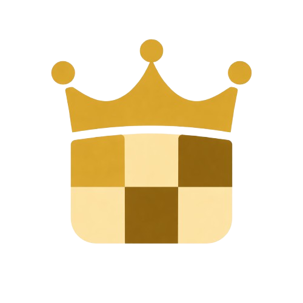

<p align="center">
  
</p>

<h1 align="center">CHESSOS</h1>
<h2 align="center">THE OPEN CHESS PLATFORM FOR EVERYONE</h2>

ChessOS is an open-source platform being built to make powerful chess tooling free and available to everyone.

This project is public, community-driven, and actively looking for contributors.

## Vision

1. Build the best free chess analysis and prediction platform using Stockfish.
2. Evolve into a chess coach that reviews your past games, tracks your game history, and helps you improve with personalized feedback, mistake detection, and learning resources.
3. Add a full games corpus so players can compare their games against historical lines and real games played by others.

## Why Contribute

- Help make high-quality chess improvement tools accessible to everyone.
- Work on real features across frontend, backend, engines, and data.
- Shape the roadmap of a platform intended for long-term community ownership.

## Contribution Areas Needed

- Engine and analysis quality improvements (Stockfish integration and insights).
- Chess coach logic (mistake patterns, improvement plans, recommendation system).
- Games corpus ingestion and indexing pipelines.
- Opening and historical line comparison features.
- API, performance, UI/UX, and developer tooling.
- Documentation, issue triage, and testing.

## Local Development

### Prerequisites

- Node.js + npm
- Python 3.11+
- Poetry

### Run Both Services

```bash
./run.sh
```

This starts:

- Backend (FastAPI + Uvicorn)
- Web client (Vite + React)

## Open Source and Community

- License: MIT
- Status: Early-stage and actively evolving
- Contributions: Welcome from all skill levels

If you want to contribute, open an issue with your idea, pick an existing issue, or submit a pull request directly.
